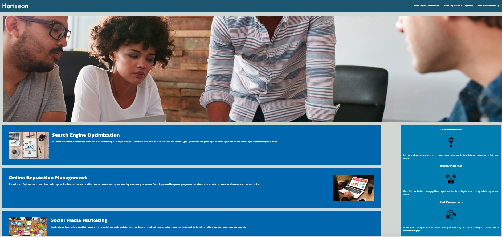

# Horiseon Social Services Project

This submission is a code refactor project to enhance the the accessibility of the Horiseon Social Services website.  

## Motivation

This project was to increase the accessibility for Horiseon Social Services and enhance the legibility of the main website code.  The following actions were taken to enhance the overall accessibility of this website.

   ### HTML Updates

  - Changed necessary divs to reflect more semantic elements
  - Updated the webpage title to reflect the company name
  - Added keywords for SEO optimization
  - Commented out coding to find content sections more easily for future updates 
  
   ### CSS Updates
  
  - Edited out repeating code and condensed CSS coding
  - Reorganized CSS structure to match up with the HTML code
  - Commented out CSS coding to find sections more easily for future updates

## Installation 

- If not already installed, please download the latest version of Visual Studio Code at https://code.visualstudio.com/
- Fork and clone the repository to your personal machine
- Create a Horiseon document folder
- Commit changes to repository
- Deploy changes to repository

## Site Preview

When deployed, the Horiseon Social Services site should resemble the preview below

